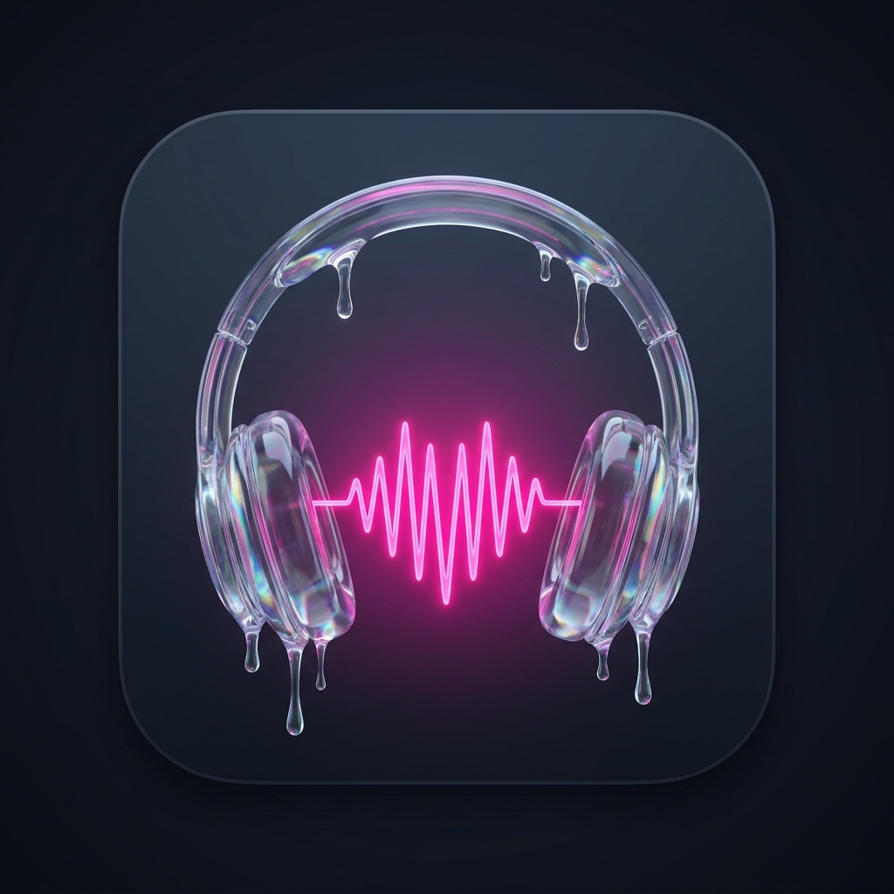
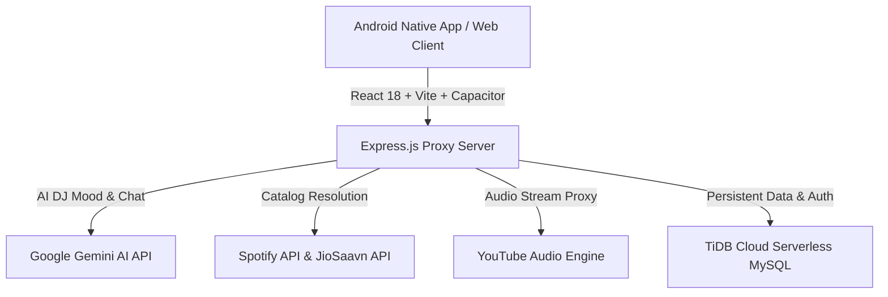

<div align="center">

  

  # 🎵 Suno Music
  ### *Millions of Songs. Free. Ad-Free. Forever.*

  <p align="center">
    <b>A modern, open-source, full-stack music streaming platform with synchronized lyrics, AI DJ, and 320kbps high-fidelity audio. Built with React 18, Capacitor, Express, and TiDB Cloud Serverless.</b>
  </p>

  <p align="center">
    <a href="https://github.com/Saurav3587/Suno-Music/releases/latest"></a>
    <a href="#-download-apk"></a>
    <a href="https://github.com/Saurav3587/Suno-Music/stargazers"></a>
    <a href="LICENSE"></a>
    <a href="https://suno-music-x6c4.onrender.com"></a>
  </p>

  <p align="center">
    <a href="#-features">Features</a> •
    <a href="#-download-apk">Download APK</a> •
    <a href="#-suno-music-vs-spotify-free">Comparison</a> •
    <a href="#-tech-stack">Tech Stack</a> •
    <a href="#-quick-start">Quick Start</a> •
    <a href="#-contributing">Contributing</a>
  </p>

</div>

---

## 🚀 Why Suno Music?

Most music streaming apps today lock basic features behind expensive subscriptions, interrupt your favourite tracks with jarring audio ads, enforce shuffle-only restrictions, and limit your skips.

**Suno Music** was built to break those barriers: a **100% free, privacy-friendly, open-source alternative** designed with a romantic dark-mode liquid glassmorphic aesthetic, seamless cross-device synchronization, and an intelligent **AI DJ** that understands what you want to hear.

---

## ✨ Features

### 🎧 Pure Audio Experience
- **🚫 100% Ad-Free:** Zero audio ads, zero video interstitials, and zero banner tracking.
- **🔊 320kbps High-Fidelity Audio:** High-bitrate audio streaming with automated multi-source fallback (JioSaavn 320kbps lossless + YouTube streaming backup).
- **🧹 Clean Audio Filter:** Intelligent algorithm automatically filters out sped-up, slowed+reverb, meme mashups, and ringtones so you hear only original master studio recordings.
- **⏭️ Unlimited Skips & On-Demand Play:** Play any song, album, or playlist instantly without forced shuffle.

### 🎤 Synchronized Lyrics & Visualizer
- **Synced Karaoke Lyrics:** Real-time synchronized lyrics that follow every verse smoothly.
- **Fluid Audio Visualizer:** Interactive dynamic waveform visualizer responding directly to track frequencies.

### 🤖 Gemini-Powered AI DJ
- **Conversational DJ Companion:** Talk directly to your AI DJ right inside the player.
- **Vibe & Mood Interpretation:** Ask for *"rainy day acoustic indie"*, *"high-energy late night gym"*, or *"90s Bollywood road trip"* — the AI curates and queues custom tracks dynamically.
- **Persistent Taste Profile:** Learns your favorite artists and genres over time with zero creepy telemetry.

### 📱 Native Mobile & PWA
- **Android Native App:** Powered by Capacitor 8 with full hardware audio pipeline.
- **Background Playback & Lock-Screen Controls:** Complete `MediaSession` integration with album art, scrub bars, and next/prev controls right on your phone's lock screen and notification shade.
- **OTA In-App Updates:** Update frontend features and performance patches without having to reinstall the APK.
- **Voice Search:** Find any song or artist hands-free using speech recognition.

### ☁️ Resilient Cloud Syncing
- **TiDB Cloud Serverless:** Distributed, multi-region SQL database ensuring your playlists, liked songs, and profiles never sleep, expire, or get deleted.
- **Smart Phone Number Auth:** Instant login with your phone number or unique handle, featuring intelligent country code (`+91`) normalization.

---

## 📲 Download APK

Get the latest Android release directly from GitHub:

<div align="center">
  <a href="https://github.com/Saurav3587/Suno-Music/releases/latest/download/SunoMusic-release.apk">
    
  </a>
  <p><i>Compatible with Android 8.0 (Oreo) and above.</i></p>
</div>

Or try the live web player in your browser:  
👉 **[Launch Suno Music Web](https://suno-music-x6c4.onrender.com)**

---

## 📊 Suno Music vs. Spotify Free vs. YouTube Music

| Feature | 🎵 **Suno Music** | 🟢 **Spotify Free** | 🔴 **YouTube Music Free** |
| :--- | :---: | :---: | :---: |
| **Audio Ads** | **None (Zero)** | Every 2–3 songs | Frequent audio/video ads |
| **Pick & Play Any Song** | ✅ **Unlimited** | ❌ Shuffle-only on mobile | ✅ Allowed with ads |
| **Skips** | ✅ **Unlimited** | ❌ 6 skips per hour | ❌ Limited |
| **Audio Quality** | ✅ **Up to 320 kbps** | ❌ 160 kbps | ❌ 128 kbps |
| **Background / Screen-Off Play** | ✅ **Yes (Free)** | ✅ Yes | ❌ Requires Premium |
| **Synchronized Lyrics** | ✅ **Free & Unlimited** | ❌ Monthly limit on free | ❌ Static only |
| **AI DJ & Mood Queues** | ✅ **Included (Gemini)** | ❌ Premium only | ❌ Premium only |
| **Open Source** | ✅ **100% MIT** | ❌ Proprietary | ❌ Proprietary |

---

## 🛠️ Tech Stack



### Frontend
- **Framework:** React 18 with Vite 6
- **Mobile Native Runtime:** Capacitor 8 (Android)
- **Styling:** Liquid Glassmorphism & Romantic Glow CSS Design System
- **Icons:** Lucide React
- **Animations:** CSS Cubic-Bezier Keyframe Engines & Canvas Confetti

### Backend & Infrastructure
- **Server:** Node.js + Express.js
- **Database:** [TiDB Cloud Serverless](https://tidbcloud.com/) (Distributed MySQL, 50M RUs/mo free, 3-node Raft consensus)
- **Cloud Hosting:** [Render](https://render.com/)
- **AI Engine:** Google Gemini 1.5 Pro / Flash
- **Audio Routing:** Custom streaming proxy with decryptor engine & JioSaavn 320kbps decoder

---

## 💻 Quick Start (Run Locally)

### 1. Clone the Repository
```bash
git clone https://github.com/Saurav3587/Suno-Music.git
cd Suno-Music
```

### 2. Install Dependencies
```bash
npm install
```

### 3. Set Up Environment Variables
Copy `.env.example` to `.env`:
```bash
cp .env.example .env
```
Fill in your database and API credentials in `.env`:
```env
# TiDB Cloud Serverless or Local MySQL
DB_HOST=gateway01.ap-southeast-1.prod.aws.tidbcloud.com
DB_USER=your_user.root
DB_PASSWORD=your_password
DB_NAME=suno_music
DB_PORT=4000

# Authentication & AI
JWT_SECRET=your_jwt_secret_key_here
PORT=3001
GEMINI_API_KEY=your_gemini_api_key
```

### 4. Start Development Server
```bash
npm run dev
```
Open **http://localhost:5173** in your browser!

### 5. Inspect Live Database Stats Anytime
```bash
npm run db:users
```

---

## 📱 Building the Android APK

If you want to compile your own APK using Android Studio:

```bash
# 1. Build web bundle
npm run build

# 2. Sync assets with native Android project
npx cap sync android

# 3. Open in Android Studio
npx cap open android
```
Inside Android Studio, go to **Build → Build Bundle(s) / APK(s) → Build APK(s)**.

---

## 🤝 Contributing

Contributions are what make the open-source community an amazing place to learn, inspire, and create! Any contributions you make are **greatly appreciated**.

1. Fork the Project
2. Create your Feature Branch (`git checkout -b feature/AmazingFeature`)
3. Commit your Changes (`git commit -m 'feat: add some amazing feature'`)
4. Push to the Branch (`git push origin feature/AmazingFeature`)
5. Open a Pull Request

---

## 📄 License

Distributed under the **MIT License**. See `LICENSE` for more information.

---

<div align="center">
  <p>Made with ❤️ by <a href="https://github.com/Saurav3587">Saurav Kumar</a></p>
  <p><b>If you like Suno Music, please consider giving it a ⭐ star on GitHub! It helps more people discover free music.</b></p>
</div>
