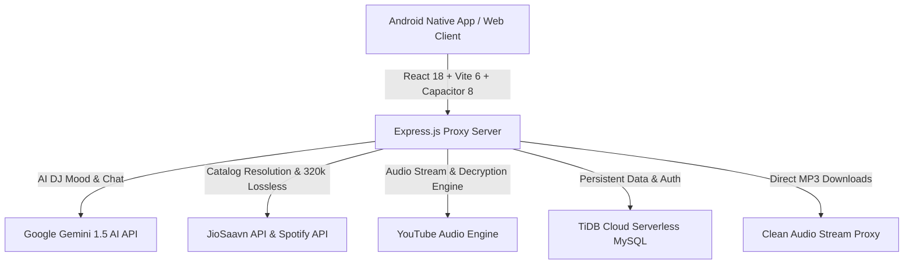

<div align="center">

  

  # 🎵 Suno Music
  ### *Millions of Songs. Free. Ad-Free. Forever.*

  <p align="center">
    <b>A modern, open-source, full-stack music streaming platform with synchronized lyrics, AI DJ, 320kbps offline downloads, sleep timer, and native Android playback. Built with React 18, Capacitor 8, Express, and TiDB Cloud Serverless.</b>
  </p>

  <p align="center">
    <a href="https://github.com/Saurav3587/Suno-Music/releases/latest"></a>
    <a href="#-download-apk"></a>
    <a href="https://github.com/Saurav3587/Suno-Music/stargazers"></a>
    <a href="LICENSE"></a>
    <a href="https://suno-music-x6c4.onrender.com"></a>
  </p>

  <p align="center">
    <a href="#-features">Features</a> •
    <a href="#-download-apk">Download APK</a> •
    <a href="#-suno-music-vs-spotify-free-vs-youtube-music">Comparison</a> •
    <a href="#-tech-stack">Tech Stack</a> •
    <a href="#-quick-start">Quick Start</a> •
    <a href="#-building-the-android-apk">Android Build</a> •
    <a href="#-contributing">Contributing</a>
  </p>

</div>

---

## 🚀 Why Suno Music?

Commercial music streaming services have progressively worsened the free listening experience: they force 30-second unskippable audio ads every 2–3 tracks, restrict mobile playback to shuffle-only, cap skips to 6 per hour, lock background audio behind paywalls, and restrict high-bitrate streaming.

**Suno Music** is designed to eliminate every one of those artificial barriers:
- **100% Free & Ad-Free:** Zero audio ads, zero popups, zero tracking scripts.
- **Pure Hi-Fi Audio:** 320kbps stream quality with multi-source fallback and studio master audio filters.
- **Unrestricted Controls:** On-demand playback for any track, album, or artist with unlimited skips.
- **Offline MP3 Downloads:** Save high-quality 320kbps tracks directly to your device with clean metadata.
- **Sleek Aesthetic:** Romantic dark-mode liquid glassmorphism, responsive across desktop and native Android.

---

## ✨ Features

### 🎧 Pure Audio Experience
- **🚫 100% Ad-Free:** Zero audio ads, zero video interstitials, and zero banner tracking.
- **🔊 320kbps High-Fidelity Audio:** High-bitrate audio streaming with automated multi-source fallback (JioSaavn 320kbps lossless + YouTube streaming backup).
- **🧹 Clean Audio Filter:** Intelligent algorithm automatically filters out sped-up, slowed+reverb, meme mashups, and ringtones so you hear only original studio master recordings.
- **⏭️ Unlimited Skips & On-Demand Play:** Play any song, album, or playlist instantly without forced shuffle.
- **🔁 Anti-Repeat Queue Progression:** Deterministic smart queue engine prevents tracks from looping and guarantees smooth transitions.

### 📥 Offline Downloads & Sleep Timer
- **⚡ 320kbps Direct MP3 Download:** 1-click download streaming tracks directly with clean metadata file naming (`Title - Artist.mp3`), completely DRM-free.
- **🌙 Sleep Timer with Live Countdown:** Set timers for **5m, 15m, 30m, 45m, 60m**, or **End of Current Track**. Includes a persistent countdown badge and gentle auto-pause.
- **📋 "Up Next" Bottom Sheet Drawer:** Slide-up queue drawer allowing you to preview upcoming songs, jump directly to any track, or prune the queue on the fly.

### 🎤 Synchronized Lyrics & Dynamic Visualizer
- **Synced Karaoke Lyrics:** Real-time synchronized lyrics scrolling smoothly in sync with every vocal line.
- **Fluid Audio Visualizer:** Dynamic interactive frequency visualizer responding in real-time to track audio.

### 🤖 Gemini-Powered AI DJ
- **Conversational DJ Companion:** Chat directly with your AI DJ right inside the player.
- **Vibe & Mood Interpretation:** Ask for *"rainy night acoustic lo-fi"*, *"high-energy late night gym synthwave"*, or *"90s Bollywood road trip"* — the AI curates and queues custom tracks dynamically.
- **Adaptive Taste Profile:** Remembers your favorite genres and artists without privacy-invasive tracking.

### 📱 Native Mobile Experience (Android & PWA)
- **Native Android APK:** Built on Capacitor 8 with full hardware audio pipeline integration.
- **Background Playback & Lock-Screen Media Controls:** Full `MediaSession` integration with high-res artwork, scrub timeline, and playback controls on your lock screen and notification drawer.
- **🎙️ Voice Search:** Native Android speech recognition plugin (`RECORD_AUDIO`) with Web Speech API fallback for hands-free music discovery.
- **🔄 OTA In-App Updates:** Automatic update checker that notifies users of new releases and downloads the latest APK seamlessly.

### ☁️ Cloud Sync & Spotify Integration
- **TiDB Cloud Serverless:** Distributed, multi-region SQL database ensuring your playlists, liked tracks, and profiles are always accessible with 99.99% availability.
- **Spotify Playlist Import:** One-click import tool to bring your favorite public Spotify playlists directly into Suno Music.
- **Smart Phone & Handle Auth:** Fast login with phone number (featuring automatic `+91` normalization) or custom username.
- **Profile Customization:** Personalize your profile with custom bios and an interactive avatar image cropper.

---

## 📲 Download APK

Get the latest Android release directly from GitHub:

<div align="center">
  <a href="https://github.com/Saurav3587/Suno-Music/releases/latest/download/SunoMusic-release.apk">
    
  </a>
  <p><i>Compatible with Android 8.0 (Oreo) and above. Includes built-in OTA update support.</i></p>
</div>

Or try the live web player in your browser:  
👉 **[Launch Suno Music Web](https://suno-music-x6c4.onrender.com)**

---

## 📊 Suno Music vs. Spotify Free vs. YouTube Music

| Feature | 🎵 **Suno Music** | 🟢 **Spotify Free** | 🔴 **YouTube Music Free** |
| :--- | :---: | :---: | :---: |
| **Audio Ads** | **None (Zero)** | Every 2–3 songs | Frequent audio/video ads |
| **Pick & Play Any Song** | ✅ **Unlimited** | ❌ Shuffle-only on mobile | ✅ Allowed with ads |
| **Track Skips** | ✅ **Unlimited** | ❌ 6 skips per hour | ❌ Limited |
| **Audio Quality** | ✅ **Up to 320 kbps** | ❌ 160 kbps | ❌ 128 kbps |
| **Offline MP3 Download** | ✅ **Direct 320kbps (DRM-Free)** | ❌ Premium only | ❌ Premium only |
| **Background / Lock-Screen Play** | ✅ **Yes (Free)** | ✅ Yes | ❌ Requires Premium |
| **Synchronized Lyrics** | ✅ **Free & Unlimited** | ❌ Monthly limit on free | ❌ Static only |
| **Sleep Timer** | ✅ **Included (with Countdown)** | ✅ Included | ❌ Limited |
| **Up Next Queue Drawer** | ✅ **Full Control** | ❌ Limited on mobile | ❌ Limited |
| **AI DJ & Mood Queues** | ✅ **Included (Gemini AI)** | ❌ Premium only | ❌ Premium only |
| **Voice Search** | ✅ **Native Android + Web** | ✅ Yes | ✅ Yes |
| **Spotify Playlist Import** | ✅ **1-Click Import** | ❌ N/A | ❌ N/A |
| **Open Source** | ✅ **100% MIT** | ❌ Proprietary | ❌ Proprietary |

---

## 🛠️ Tech Stack



### Frontend
- **Framework:** React 18 with Vite 6
- **Mobile Native Runtime:** Capacitor 8 (Android)
- **Styling:** Liquid Glassmorphism & Romantic Glow CSS Design System
- **Icons:** Lucide React
- **Animations & Effects:** Custom Cubic-Bezier Keyframe Engines & Canvas Confetti
- **Audio & Media:** HTML5 Audio with MediaSession API & Web Audio Visualizer

### Backend & Infrastructure
- **Server:** Node.js + Express.js
- **Database:** [TiDB Cloud Serverless](https://tidbcloud.com/) (Distributed MySQL, 50M RUs/mo free, 3-node Raft consensus)
- **Cloud Hosting:** [Render](https://render.com/)
- **AI Engine:** Google Gemini 1.5 Pro / Flash
- **Audio Routing & Download:** Multi-source audio decryption stream proxy with JioSaavn 320kbps decoder and direct attachment pipeline

---

## 💻 Quick Start (Run Locally)

### 1. Clone the Repository
```bash
git clone https://github.com/Saurav3587/Suno-Music.git
cd Suno-Music
```

### 2. Install Dependencies
```bash
npm install
```

### 3. Set Up Environment Variables
Copy `.env.example` to `.env`:
```bash
cp .env.example .env
```
Configure your credentials in `.env`:
```env
# TiDB Cloud Serverless or Local MySQL
DB_HOST=gateway01.ap-southeast-1.prod.aws.tidbcloud.com
DB_USER=your_user.root
DB_PASSWORD=your_password
DB_NAME=suno_music
DB_PORT=4000

# Authentication & Server Port
JWT_SECRET=your_jwt_secret_key_here
PORT=3001

# Google Gemini AI (for AI DJ)
GEMINI_API_KEY=your_gemini_api_key
```

### 4. Start Development Server
```bash
npm run dev
```
Open **http://localhost:5173** in your browser! Both the Vite frontend client and Express backend server will start concurrently with hot reload.

### 5. Inspect Live Database Stats
```bash
npm run db:users
```

---

## 📱 Building the Android APK

To compile your own native Android APK:

```bash
# 1. Build the production web bundle
npm run build

# 2. Sync web assets into the native Android project
npx cap sync android

# 3. Open project in Android Studio
npx cap open android
```

Inside Android Studio:
1. Navigate to **Build → Build Bundle(s) / APK(s) → Build APK(s)**.
2. The compiled APK will be located at `android/app/build/outputs/apk/release/` or `android/app/build/outputs/apk/debug/`.

---

## 🤝 Contributing

Contributions make the open-source community an inspiring place to build and collaborate. Any contributions you make are **warmly appreciated**.

1. Fork the Project
2. Create your Feature Branch (`git checkout -b feature/AmazingFeature`)
3. Commit your Changes (`git commit -m 'feat: add some amazing feature'`)
4. Push to the Branch (`git push origin feature/AmazingFeature`)
5. Open a Pull Request

---

## 📄 License

Distributed under the **MIT License**. See `LICENSE` for more information.

---

<div align="center">
  <p>Made with ❤️ by <a href="https://github.com/Saurav3587">Saurav Kumar</a></p>
  <p><b>If you enjoy Suno Music, please consider giving it a ⭐ star on GitHub! It helps more people discover free music.</b></p>
</div>
